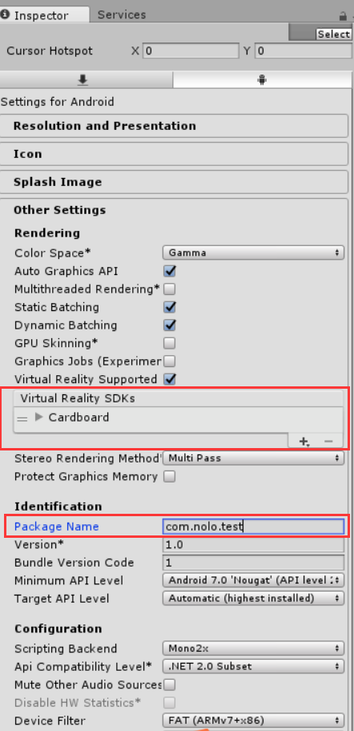

# Getting Started

## Download NOLO SDK For Unity
* Download [NOLO SDK For Unity](https://github.com/NOLOVR/NOLO-Unity-SDK/tree/master/Downloads) to local.

#
## Import to Unity
1. Download and install [Unity](https://unity3d.com). It is recommended to use Unity 5.6.   

2. Open Unity, Click “NEW”. Fill in your project name and file path. Click “Create project”. (Creates a new Unity project) 

3. Click menu Assets -> Import Package -> Custom Package. 

  
4. Browse for NoloVR SDK For Unity and open it. 
 
 

5. Import complete. 

  
#
## Example: Build Gear VR
1. Open NoloVR\Example\General\Test. 

2. Click File -> Build Setting, click Add Open Scenes, choose Android and click Switch Playform. 

3. Click Player Settings, modify Bundle Identifier, check Virtual Reality Supported and Add Oculus SDK. 

 

  

4. Click build, then install to mobile phone. 

 

#
## Example: Build Daydream
1. Import [NOLO SDK For Unity](https://github.com/NOLOVR/NOLO-Unity-SDK/blob/master/NoloVR_SDK_1.1.2_20170524.unitypackage) the same way.

2. Open NoloVR\Example\General\Test.   

3. Click File->Build Setting, Click "Add Open Scenes", Choose "Android", Click "Switch Playform". 

  

4. Click Player Settings, Modify Bundle Identifier, Check "Virtual Reality Supported" and Add Daydream. 

 

  

5. Click "build", then install to mobile phone. 

 

#
## Example: Build CardBoard
1. Import [NOLO SDK For Unity](https://github.com/NOLOVR/NOLO-Unity-SDK/blob/master/NoloVR_SDK_1.1.2_20170524.unitypackage)  the same way.

2. Open NoloVR\Example\General\Test.  

3. Click File->Build Setting, Click "Add Open Scenes", Choose "Android", Click "Switch Playform". 

  

4. Click "Player Settings", Modify Bundle Identifier, Check "Virtual Reality Supported" and Add "Cardboard". 

 

  

5. Click "build", then install to mobile phone. 

 

#
## For other VR headsets
* Drag the headset prefab from the headset SDK to NoloManager->Hmd(camera), making it Hmd(camera)'s child-game-object. Reset position and rotation.
* Find NoloVR_Manager.cs from NoloManager, drag the Camera object, whose rotation changes when the game's running, to VR Camera.
* The rest of steps please refer to Gear VR and Cardboard examples.
