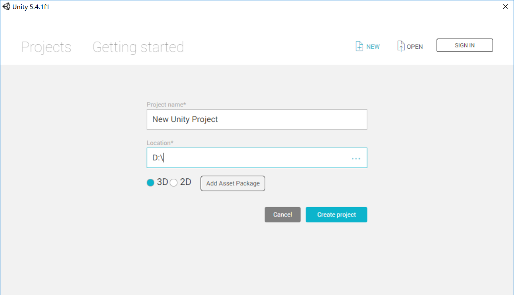
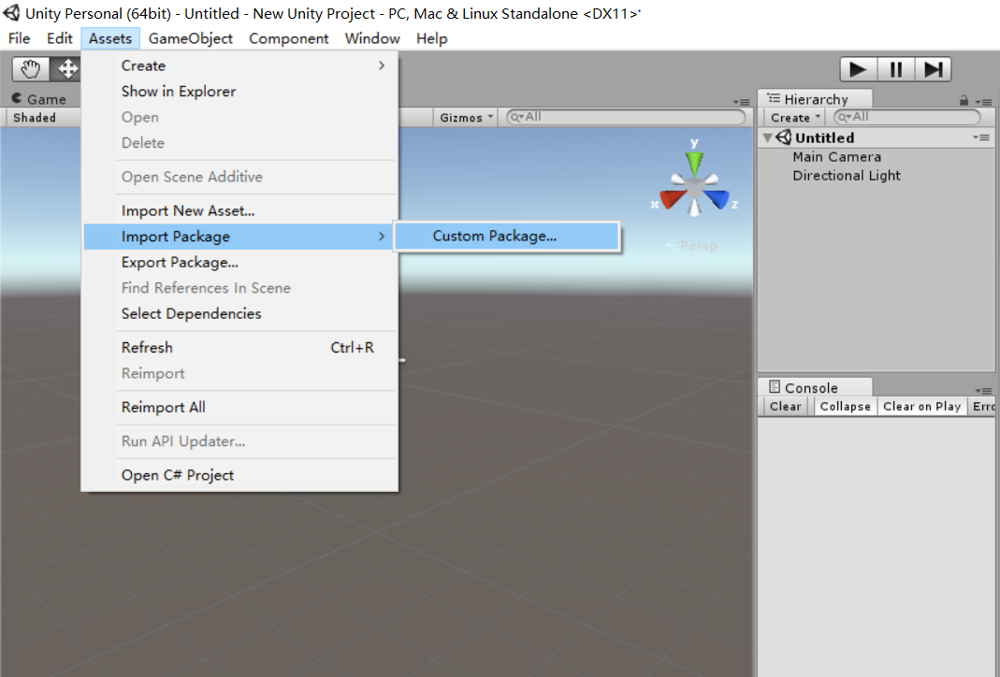
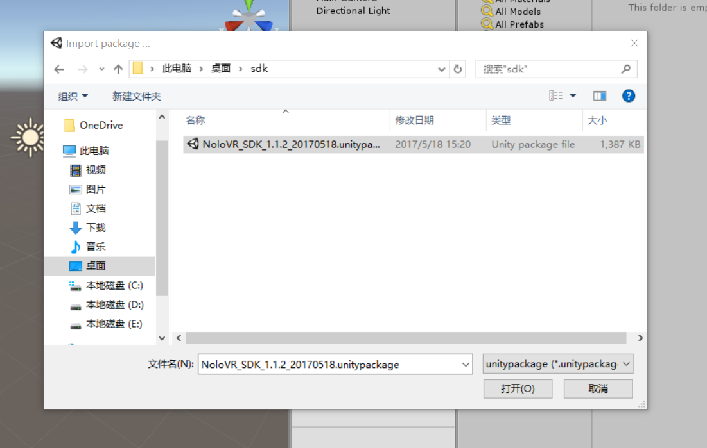
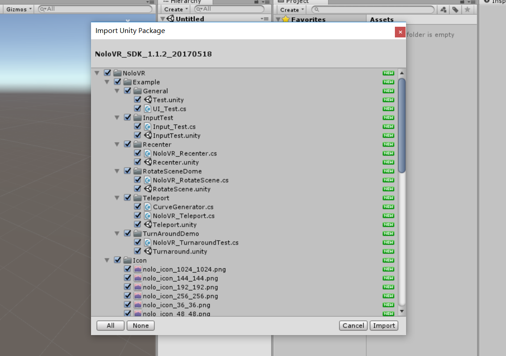
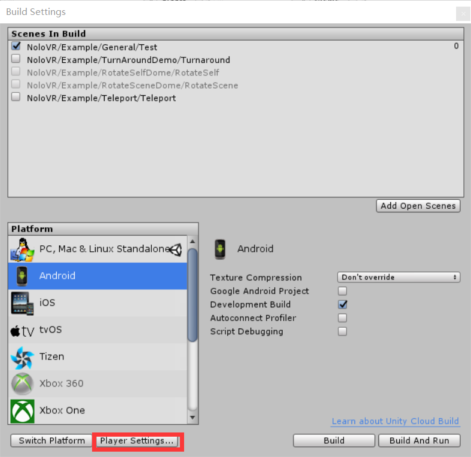

# 快速入门

## 下载 NOLO SDK For Unity
* 下载 [NOLO SDK For Unity](https://github.com/NOLOVR/NOLO-Unity-SDK/tree/master/Downloads) 到本地。
#
## 导入unity
1. 下载并安装 [Unity](https://unity3d.com)。建议使用 Unity5.6。

2. 打开Unity，点击“NEW”，填写好你的工程名字和路径，点击“Creata project”，创建一个新的Unity工程。

  

3. 点击菜单 Assets->Import Package->Custom Package。 

  
  
4. 浏览到 NOLO SDK For Unity 所在的目录并打开。  
 
 

  

5. 导入完成。

  
#
## 打包 Gear VR示例
1. 打开NoloVR\Example\General\Test场景。 

2. 点击File->Build Setting，点击Add Open Scenes,在Playform中选择Android，点击Switch Playform。

3. 点击Player Settings，修改Bundle Identifier，勾选Virtual Reality Supported并添加Oculus SDK。

 

 

4. 点击build，完成后然后安装到手机。

 

#
## 打包 Daydream 示例
1. 用同样的方式导入[NOLO SDK For Unity](https://github.com/LyrobotixNolo/NOLO-Unity-SDK/blob/master/NoloVR_SDK_1.1.2_20170524.unitypackage)。

2. 打开NoloVR\Example\General\Test场景。  

3. 点击File->Build Setting，点击Add Open Scenes,在Playform中选择Android，点击Switch Playform。

  

4. 点击Player Settings，修改Bundle Identifier，勾选Virtual Reality Supported并添加Daydream。

 

  

5. 点击build然后安装到手机。

 

#
## 打包 CardBoard 示例
1. 用同样的方式导入[NOLO SDK For Unity](https://github.com/LyrobotixNolo/NOLO-Unity-SDK/blob/master/NoloVR_SDK_1.1.2_20170524.unitypackage)。

2. 打开NoloVR\Example\General\Test场景。  

3. 点击File->Build Setting，点击Add Open Scenes,在Playform中选择Android，点击Switch Playform。

  

4. 点击Player Settings，修改Bundle Identifier，勾选Virtual Reality Supported并添加Cardboard。

 

  

5. 点击build然后安装到手机。

 

#
## 其他VR头盔SDK
* 将头盔SDK中的预制体拖拽到NoloManager->Hmd(camera)下，变成Hmd(camera)的子物体，并将position和rotation都清零。
* NoloManager上找到挂载的NoloVR_Manager.cs脚本，将游戏运行时姿态真正发生变化的Camera物体拖至VR Camera处。
* 其他步骤参考Gear VR和CardBoard。
